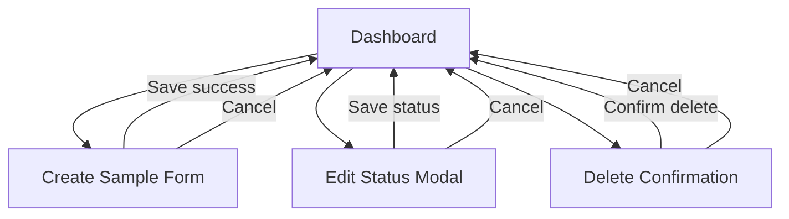

# UI Wireframes and Screen Flow Documentation

## LabFlow Sample Management System

**Document Status:** Draft  
**Document Type:** UI Wireframes and Screen Flow  
**Primary Users:** Lab Technicians, Scientists  
**Lifecycle Model:** `Pending` -> `Processing` -> `Completed`

## 1. Purpose

This document defines the core UI wireframes and screen flow for the Sample Management System MVP. It focuses on the main user interactions required to create samples, review active work, update sample status, and remove samples from active workflows.

The goal is to provide a simple, consistent, and automation-friendly user experience that supports internal laboratory operations.

## 2. Design Principles

- Keep the workflow easy to understand for both technicians and scientists.
- Prioritize fast access to sample status and next actions.
- Use clear labels and predictable layouts instead of dense or highly dynamic UI patterns.
- Make critical actions explicit, especially status updates and delete operations.
- Support responsive behavior without changing the meaning of actions between desktop and mobile.
- Use deterministic UI structure and stable selectors to simplify automated testing.

## 3. Primary Screen Flow



## 4. User Flow Summary

1. User lands on the `Dashboard` and reviews sample counts, filters, and sample list.
2. User selects `Create Sample` to open the `Create Sample Form`.
3. User enters required sample information and saves the record.
4. User returns to the `Dashboard` and sees the new sample in `Pending`.
5. User selects a sample action and opens the `Edit Status Modal`.
6. User changes the status from `Pending` to `Processing`, or from `Processing` to `Completed`.
7. User can also choose `Delete` from the sample action area and confirm removal using the `Delete Confirmation` dialog.

## 5. Screen Specifications

### 5.1 Dashboard

**Purpose:** Central workspace for reviewing sample activity, creating new samples, and triggering status or delete actions.

#### Component Layout

- Top header with product title and primary action button
- Summary cards for sample counts by status
- Filter and search toolbar
- Sample list table with action column
- Empty state when no samples are available

#### Desktop Wireframe

```text
+----------------------------------------------------------------------------------+
| LabFlow Sample Management                         [Create Sample]                 |
+----------------------------------------------------------------------------------+
| [Total Samples] [Pending] [Processing] [Completed]                               |
+----------------------------------------------------------------------------------+
| Search [______________]  Status [All v]  Owner [All v]  [Reset Filters]          |
+----------------------------------------------------------------------------------+
| Sample ID   | Name                  | Type   | Owner      | Status      | Action |
|-------------|-----------------------|--------|------------|-------------|--------|
| SMP-0001    | Water Quality Sample  | Water  | Dr. Mehta  | Pending     | [..]   |
| SMP-0002    | Tissue Sample B       | Tissue | Dr. Rao    | Processing  | [..]   |
| SMP-0003    | Soil Sample A         | Soil   | Dr. Singh  | Completed   | [..]   |
+----------------------------------------------------------------------------------+
| Pagination: < Prev  1  2  3  Next >                                               |
+----------------------------------------------------------------------------------+
```

#### Mobile Wireframe

```text
+--------------------------------------+
| LabFlow                [Create]      |
+--------------------------------------+
| [Total] [Pending] [Processing]       |
| [Completed]                          |
+--------------------------------------+
| Search [____________]                |
| Status [All v]                       |
| Owner  [All v]                       |
+--------------------------------------+
| SMP-0001                             |
| Water Quality Sample                 |
| Owner: Dr. Mehta                     |
| Status: Pending                      |
| [Edit Status] [Delete]               |
+--------------------------------------+
| SMP-0002                             |
| Tissue Sample B                      |
| Owner: Dr. Rao                       |
| Status: Processing                   |
| [Edit Status] [Delete]               |
+--------------------------------------+
```

#### Responsive Considerations

- On desktop, use a table for scan efficiency.
- On tablet and mobile, convert rows into stacked cards.
- Keep the `Create Sample` action visible above the fold on all screen sizes.
- Preserve the same filter order across breakpoints to reduce user confusion.

#### Automation-Friendly Design Decisions

- Use stable selectors for key elements such as `create-sample-button`, `sample-table`, `sample-row-{id}`, and `status-filter`.
- Keep action buttons directly visible on mobile cards instead of hiding them in gesture-only interactions.
- Use semantic table markup on desktop for reliable row and column targeting in tests.
- Keep status chips text-based and deterministic: `Pending`, `Processing`, `Completed`.

### 5.2 Create Sample Form

**Purpose:** Allow users to register a new sample with required metadata.

#### Component Layout

- Page title and breadcrumb or back action
- Form section with required sample fields
- Optional details section
- Inline validation messages
- Footer actions for `Cancel` and `Save Sample`

#### Desktop Wireframe

```text
+----------------------------------------------------------------------------------+
| <- Back to Dashboard                                                             |
| Create Sample                                                                    |
+----------------------------------------------------------------------------------+
| Sample ID*        [____________________]   Sample Name*   [____________________] |
| Sample Type*      [____________________]   Owner*         [____________________] |
| Project           [____________________]   Source         [____________________] |
| Notes                                                                    [____]  |
|                                                                          [____]  |
|                                                                          [____]  |
+----------------------------------------------------------------------------------+
| Status: Pending (system default)                                                 |
+----------------------------------------------------------------------------------+
| [Cancel]                                                       [Save Sample]     |
+----------------------------------------------------------------------------------+
```

#### Mobile Wireframe

```text
+--------------------------------------+
| <- Dashboard                         |
| Create Sample                        |
+--------------------------------------+
| Sample ID*                           |
| [______________________________]     |
| Sample Name*                         |
| [______________________________]     |
| Sample Type*                         |
| [______________________________]     |
| Owner*                               |
| [______________________________]     |
| Project                              |
| [______________________________]     |
| Source                               |
| [______________________________]     |
| Notes                                |
| [______________________________]     |
| [______________________________]     |
| Status: Pending                      |
+--------------------------------------+
| [Cancel]        [Save Sample]        |
+--------------------------------------+
```

#### Responsive Considerations

- Use a two-column layout on desktop and a single-column layout on mobile.
- Keep required fields near the top of the form for faster completion.
- Ensure action buttons remain fixed or easily reachable on smaller screens.
- Avoid modal presentation for the full form on mobile to preserve space and usability.

#### Automation-Friendly Design Decisions

- Each input should have a persistent label and unique field identifier.
- Validation messages should appear near the related field and use stable text.
- Required fields should be marked consistently with `*` and `aria-required`.
- The save action should remain disabled only when necessary and should expose deterministic validation states.

### 5.3 Edit Status Modal

**Purpose:** Allow users to update a sample's lifecycle state in a focused, low-friction flow.

#### Component Layout

- Modal title
- Sample summary
- Current status display
- New status selector limited to valid next transitions
- Optional comment field
- Footer actions for `Cancel` and `Save`

#### Wireframe

```text
+------------------------------------------------------------------+
| Edit Sample Status                                            [X] |
+------------------------------------------------------------------+
| Sample ID: SMP-0002                                             |
| Name: Tissue Sample B                                           |
| Current Status: Processing                                      |
+------------------------------------------------------------------+
| New Status                                                      |
| ( ) Pending      disabled                                       |
| ( ) Processing   disabled/current                               |
| (o) Completed                                                   |
+------------------------------------------------------------------+
| Comment                                                         |
| [____________________________________________________________]   |
+------------------------------------------------------------------+
| [Cancel]                                            [Save]       |
+------------------------------------------------------------------+
```

#### Status Behavior

- If current status is `Pending`, only `Processing` is selectable.
- If current status is `Processing`, only `Completed` is selectable.
- If current status is `Completed`, editing should be blocked in the standard workflow.

#### Responsive Considerations

- Keep the modal narrow and readable on desktop.
- On mobile, present it as a full-height bottom sheet or full-screen modal with the same field order.
- Ensure the primary action remains visible without requiring excessive scrolling.

#### Automation-Friendly Design Decisions

- Render status options as radio buttons with stable values.
- Disable invalid transitions in the UI rather than hiding them silently.
- Keep modal actions in a consistent order: `Cancel`, then primary action `Save`.
- Expose modal container, status group, and save button with stable selectors such as `edit-status-modal`, `status-option-processing`, and `save-status-button`.

### 5.4 Delete Confirmation

**Purpose:** Prevent accidental removal of samples from active workflows.

#### Component Layout

- Warning title
- Short explanation of soft delete behavior
- Sample summary
- Footer actions for `Cancel` and `Delete Sample`

#### Wireframe

```text
+------------------------------------------------------------------+
| Delete Sample                                                 [X] |
+------------------------------------------------------------------+
| Are you sure you want to remove this sample from active work?    |
| This action performs a soft delete and preserves history.        |
+------------------------------------------------------------------+
| Sample ID: SMP-0002                                             |
| Name: Tissue Sample B                                           |
| Current Status: Processing                                      |
+------------------------------------------------------------------+
| [Cancel]                                   [Delete Sample]       |
+------------------------------------------------------------------+
```

#### Responsive Considerations

- Keep confirmation content short so the full decision fits on smaller screens.
- Use a single focused warning message rather than multiple stacked alerts.
- Ensure the destructive action is visually distinct but not easier to tap accidentally than `Cancel`.

#### Automation-Friendly Design Decisions

- Use a dedicated destructive button with a stable selector such as `confirm-delete-button`.
- Keep sample summary fields in fixed positions for reliable verification.
- Use explicit confirmation text that can be asserted in automated tests.
- Avoid timed auto-close behavior so tests can complete deterministically.

## 6. Shared Responsive Considerations

- Maintain consistent navigation labels across desktop, tablet, and mobile.
- Prefer stacked cards over horizontal scrolling on smaller screens.
- Preserve action visibility for primary workflows instead of hiding controls behind hover states.
- Keep form labels above fields on narrow screens for readability.
- Use enough spacing between interactive elements to support both touch and mouse input.

## 7. Shared Automation-Friendly Design Decisions

- Prefer semantic HTML elements such as `button`, `form`, `table`, `dialog`, and labeled inputs.
- Use stable `data-testid` or equivalent attributes only for critical automation targets.
- Keep button names, status labels, and modal titles static and human-readable.
- Avoid random IDs, shifting DOM order, or hidden hover-only actions for important workflows.
- Keep validation and success feedback explicit so automated tests can assert outcomes reliably.
- Use predictable empty, loading, and error states instead of ambiguous skeleton-only flows.

## 8. Recommended Testable States

- Dashboard with populated sample list
- Dashboard empty state
- Create Sample Form with valid input
- Create Sample Form with validation errors
- Edit Status Modal from `Pending`
- Edit Status Modal from `Processing`
- Delete Confirmation for active sample
- Mobile layout for dashboard and form

## 9. Summary

The MVP UI should emphasize clarity, fast task completion, and predictable workflows. The four core screens in this document support the main sample management lifecycle while staying responsive and straightforward to automate for regression and end-to-end testing.
